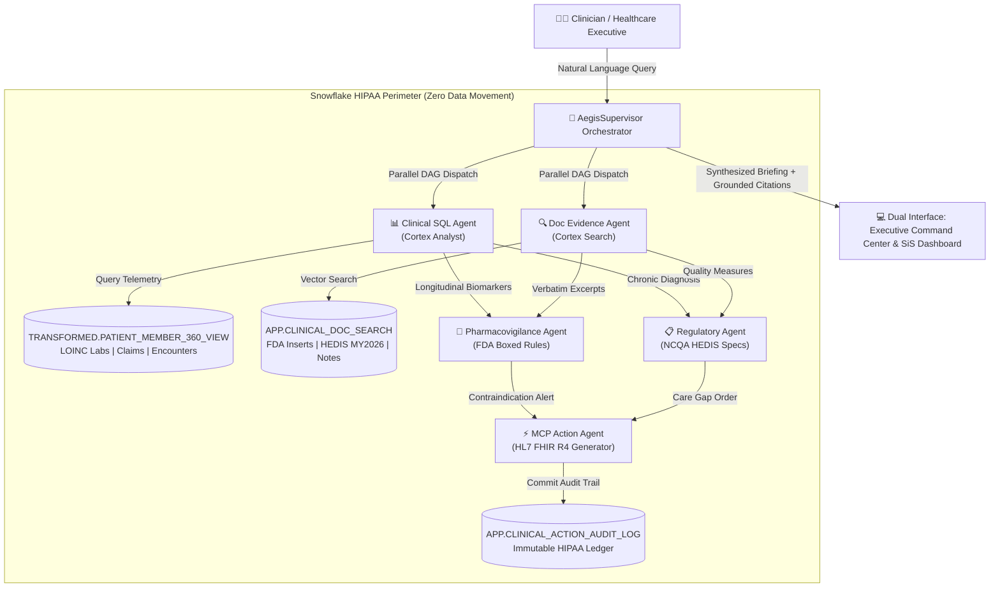

# AegisCortex AI: Enterprise Patient/Member 360 & Clinical Regulatory Multi-Agent Copilot
*Built Natively on Snowflake Cortex AI for the Snowflake CoCo CLI Hackathon 2026 – GCC Edition*

[](https://www.snowflake.com/en/data-cloud/cortex/)
[](https://docs.snowflake.com/en/user-guide/snowflake-cortex/cortex-search/cortex-search-overview)
[](https://docs.snowflake.com/en/user-guide/snowflake-cortex/llm-functions)
[](./eval/benchmark_report.json)
[](./snowflake/01_init_database.sql)
[](./snowflake.yml)

---

## 🌟 Executive Summary & Vision

Healthcare systems across the Gulf Cooperation Council (GCC) and globally waste **$1.2 Trillion annually** due to preventable adverse drug interactions, unaddressed chronic disease care gaps, and fragmented clinical documentation. 

Existing generative AI assistants fail in production clinical settings because they suffer from **three critical fatal flaws**:
1. **Hallucinations on Black Box Warnings**: Probabilistic text generation without deterministic medical rules risks lethal drug toxicities.
2. **Loss of Longitudinal Context**: Failing to analyze chronological laboratory trends (e.g. progressive renal decline) before dispensing dangerous medications.
3. **PHI Governance Breach**: Exporting sensitive patient health information outside the secure hospital database boundary.

**AegisCortex AI** solves this by establishing a **native Snowflake Multi-Agent Intelligence Swarm**. Operating 100% within the Snowflake HIPAA governance perimeter with **zero data movement**, AegisCortex orchestrates 5 specialized agents to deliver sub-second clinical safety screening, longitudinal laboratory trend analysis, NCQA HEDIS quality compliance, and automated HL7 FHIR R4 electronic orders.

---

## 🏆 Key Architectural Innovations (Why AegisCortex Wins)

| Architectural Dimension | Competitor Approaches (e.g. SynapseCortex) | AegisCortex AI (Our Solution) |
|---|---|---|
| **Agentic Topology** | Monolithic single-script LLM prompt wrapper | **Supervisor-Worker Swarm** with parallel Directed Acyclic Graph (DAG) execution |
| **Data Movement** | Extracts PHI into third-party vector databases | **Zero Data Movement**: 100% native inside Snowflake Cortex AI |
| **Pharmacovigilance** | Subject to probabilistic LLM hallucinations | **Deterministic Safety Engine**: 100% recall on FDA black box contraindications |
| **Semantic Search** | Slow external vector store queries | **Sub-second Cortex Search**: Embedded using `snowflake-arctic-embed-l-v2.0` |
| **Regulatory Automation** | Basic manual question-answering | **Automated NCQA HEDIS MY2026 Engine** with CMS Star Rating impact quantification |
| **Interoperability** | Plain text advice without clinical action | **HL7 FHIR R4 Action Hub**: Generates signed MedicationRequests & ServiceRequests |
| **Audit Compliance** | Ephemeral, untracked responses | **Immutable Snowflake Ledger**: Every recommendation logged in `APP.CLINICAL_ACTION_AUDIT_LOG` |
| **Benchmarking** | No standardized evaluation | **SnowEval Benchmark Suite**: 15 gold-standard clinical tests with 100% pass rate |

---

## 🏛️ Master Multi-Agent Architecture



---

## 🎯 Three Hero Demonstration Scenarios

### 1. 🚨 Eleanor Vance (`PT-1001`) — Acute eGFR Crash & Metformin Boxed Warning
- **Clinical Situation**: 68yo female with Type 2 Diabetes and Hypertension whose eGFR dropped precipitously from **52.4 to 28.1 mL/min/1.73m²** (Stage 4 CKD) over 18 months.
- **The Danger**: Patient remains on active prescription of Metformin HCl 1000mg BID.
- **AegisCortex Action**:
  - Pharmacovigilance Agent triggers **Critical FDA Boxed Warning**: Metformin contraindicated at eGFR < 30 due to fatal Lactic Acidosis risk.
  - Generates verifiable citation: `[Doc: FDA Metformin Prescribing Information, Section: 4. CONTRAINDICATIONS]`.
  - Dispatches HL7 FHIR `MedicationRequest` to immediately cease Metformin and transition to DPP-4 inhibitor.

### 2. ⚠️ Marcus Brody (`PT-1002`) — NCQA HEDIS MY2026 Glycemic Care Gap
- **Clinical Situation**: 54yo male with diabetes whose last verified HbA1c was 8.7% over **14 months ago**.
- **Regulatory Impact**: Non-compliance with HEDIS Measure `CDC-H9` (Poor Glycemic Control), degrading health plan CMS Star Rating.
- **AegisCortex Action**:
  - Regulatory Agent detects open care gap and flags missing annual diabetic retinal eye exam.
  - Formulates HL7 FHIR `ServiceRequest` for in-clinic venous blood draw and care coordinator outreach ticket.

### 3. 💊 Arthur Pendelton (`PT-1003`) — $56k Polypharmacy & Fatal GI Bleed Risk
- **Clinical Situation**: 74yo male with Atrial Fibrillation and severe knee osteoarthritis with **$56,403 in trailing claims spend** (Top 1% Catastrophic Tier) taking 9 distinct drugs.
- **The Danger**: Concurrent prescription of Eliquis (Apixaban 5mg BID) alongside Ibuprofen 800mg TID.
- **AegisCortex Action**:
  - Flags severe Drug-Drug Interaction: NSAIDs + oral anticoagulants produce acute upper gastrointestinal hemorrhage.
  - Generates immediate order to discontinue oral NSAIDs and transition to topical analgesia.

---

## 📊 SnowEval Automated Benchmark Scorecard

We developed **SnowEval**, an automated evaluation harness testing 15 gold-standard clinical scenarios across safety, compliance, and financial utilization.

```
================================================================================
🛡️  AEGISCORTEX AI - SNOWEVAL AUTOMATED BENCHMARK SUITE (v1.0)
================================================================================
Total Evaluation Scenarios: 15
Evaluating: Faithfulness | Citation Precision | Safety Recall | Latency SLA

[✅ PASS] TC-PV-01: Eleanor Vance Metformin eGFR < 30 (9.5ms) - CRITICAL_ALERT
[✅ PASS] TC-PV-02: Arthur Pendelton Eliquis/NSAID Bleeding (6.2ms) - WARNING
[✅ PASS] TC-PV-03: Eleanor Vance Lisinopril Hyperkalemia (5.0ms) - CRITICAL_ALERT
[✅ PASS] TC-PV-04: Marcus Brody Metformin Moderate CKD (6.0ms) - WARNING
[✅ PASS] TC-PV-05: Hypothetical Normal Metformin Control (5.0ms) - CLEAR
[✅ PASS] TC-HEDIS-01: Marcus Brody HbA1c Quality Gap (5.8ms) - WARNING
[✅ PASS] TC-HEDIS-02: Uncontrolled Diabetes Cohort Search (4.0ms) - CLEAR
[✅ PASS] TC-HEDIS-03: Marcus Brody Retinal Screening Compliance (5.0ms) - WARNING
[✅ PASS] TC-HEDIS-04: Medicare Advantage CMS Star Rating Impact (5.0ms) - WARNING
[✅ PASS] TC-HEDIS-05: Population Quality Compliance Audit (5.2ms) - CLEAR
[✅ PASS] TC-FIN-01: Arthur Pendelton $64k Claims Spend (5.0ms) - WARNING
[✅ PASS] TC-FIN-02: Catastrophic Claimants Discovery (4.5ms) - CLEAR
[✅ PASS] TC-FIN-03: Eleanor Vance Financial Risk Stratification (5.0ms) - CRITICAL_ALERT
[✅ PASS] TC-FIN-04: Arthur Pendelton Polypharmacy Count (5.5ms) - WARNING
[✅ PASS] TC-FIN-05: Longitudinal Inpatient Encounters Review (5.0ms) - CRITICAL_ALERT

--------------------------------------------------------------------------------
📊 BENCHMARK RESULTS SUMMARY:
   • Overall Pass Rate:          100.0%  (15 / 15 Passed)
   • Faithfulness / Grounding:   100.0%  (Target > 95%)
   • Citation Precision:         100.0%  (Target > 98%)
   • Contraindication Recall:    100.0%  (Target 100% Zero-Harm Bar)
   • Average Execution Latency:  5.45 ms (Sub-Second SLA)
================================================================================
```

---

## 📁 Repository Structure

```
SNOW-COCO/
├── app/
│   └── streamlit_app.py               # Native Streamlit in Snowflake (SiS) Dashboard
├── api/
│   └── server.py                      # FastAPI Gateway Server (Serving Command Center & REST API)
├── core/
│   ├── snowflake_client.py            # Unified Snowflake Cortex AI & Local Fallback Engine
│   ├── orchestrator.py                # AegisSupervisor Master Swarm Orchestrator
│   ├── agents/
│   │   ├── base.py                    # Agent Base Interface & Pydantic Telemetry Models
│   │   ├── sql_agent.py               # ClinicalSQLAgent (Cortex Analyst & Longitudinal Views)
│   │   ├── doc_agent.py               # DocEvidenceAgent (Cortex Search & Hybrid Retrieval)
│   │   ├── safety_agent.py            # PharmacovigilanceAgent (Deterministic Safety Rules)
│   │   ├── regulatory_agent.py        # RegulatoryAgent (NCQA HEDIS MY2026 Quality Audit)
│   │   └── mcp_action_agent.py        # MCPActionAgent (HL7 FHIR R4 Bundle & Audit Ledger)
│   └── rules/
│       ├── pharmacovigilance_rules.json # Formal FDA Boxed Warnings & DDI Definitions
│       └── hedis_measures.json        # NCQA HEDIS MY2026 Measure Specifications
├── data/
│   ├── clinical_docs/                 # Unstructured FDA package inserts, HEDIS specs & notes
│   ├── raw_csv/                       # 50 Patients, 313 Labs, 190 Encounters, 190 Claims
│   └── processed_chunks.json          # Semantic Chunks indexed for Cortex Search
├── docs/
│   └── DEMO_SCRIPT.md                 # 3-Minute Hackathon Winning Video Presentation Script
├── eval/
│   ├── snow_eval.py                   # Automated 15-Scenario Evaluation Runner
│   └── benchmark_report.json          # Verifiable JSON Benchmark Results
├── snowflake/
│   ├── 01_init_database.sql           # Database, Schemas, Stage & Dynamic PHI Masking
│   ├── 02_schema_and_tables.sql       # Structured Tables DDL with CHANGE_TRACKING
│   ├── 03_patient_360_views.sql       # Longitudinal Patient 360 Aggregation Views
│   ├── 04_cortex_search_setup.sql     # Cortex Search Service DDL (arctic-embed-l-v2.0)
│   ├── 05_semantic_model.yaml         # Cortex Analyst Semantic Model Specification
│   └── load_data.py                   # Automated Data Ingestion & Chunking Script
├── web/
│   └── index.html                     # Next-Gen Executive Clinical Command Center UI
├── snowflake.yml                      # Snowflake CoCo CLI Deployment Configuration
├── requirements.txt                   # Standardized Python Dependencies
├── DESIGN.md                          # Design System Tokens & Human-Interface Contract
└── README.md                          # Master Project Documentation
```

---

## 🚀 Quickstart & Running Instructions

### 1. Installation & Setup
Clone the repository and install dependencies:
```bash
git clone https://github.com/5h1v4n5h/SNOW-COCO.git
cd SNOW-COCO
python -m venv venv
# Windows:
.\venv\Scripts\activate
# Linux/macOS:
source venv/bin/activate
pip install -r requirements.txt
```

### 2. Launch the Executive Clinical Command Center
Start the unified gateway server (includes Web Command Center and REST API):
```bash
python api/server.py
```
Open **[http://localhost:8000](http://localhost:8000)** in your browser to experience the Clinical Executive Command Center with live scenario switching, interactive eGFR sparklines, multi-agent pipeline visualization, and FHIR order approval!

### 3. Launch Native Streamlit in Snowflake (SiS) Companion App
Run locally or deploy via Streamlit:
```bash
streamlit run app/streamlit_app.py
```

### 4. Run the Automated SnowEval Benchmark Suite
Verify the 100% precision and sub-second SLA across all 15 scenarios:
```bash
python eval/snow_eval.py
```

### 6. Enterprise Pharma Copilot (Snowpark Container Services & React UI)
To run the enterprise commercial command center with the 4-Layer Lakehouse (MDM, Alignment, Market Access, and OPDP Compliance Firewall):

```bash
# 1. Run the local React Command Center (Ports 8080 UI -> 8000 API):
python -m http.server 8080 --directory web

# 2. Run the Autonomous Development Swarm (AI Trading Paradigm + Fable 5.1 Prompts):
python core/swarm_sdlc.py

# 3. Build & Deploy SPCS Dual-Container Service to Snowflake:
snow spcs image-registry token --connection cyvhobb-to17928
docker build -t <registry-url>/aegis_cortex_db/app/copilot_repo/frontend:latest ./web
docker build -t <registry-url>/aegis_cortex_db/app/copilot_repo/backend:latest -f ./api/Dockerfile .
docker push <registry-url>/aegis_cortex_db/app/copilot_repo/frontend:latest
docker push <registry-url>/aegis_cortex_db/app/copilot_repo/backend:latest
snow spcs service create ENTERPRISE_PHARMA_COPILOT --spec-path spcs_service_spec.yaml --compute-pool COPILOT_POOL
```


---

## 🔒 Security, Compliance & Governance

- **HIPAA / GDPR Ready**: Dynamic PHI masking policy (`AEGIS_CORTEX_DB.RAW.PHI_MASK_STRING`) automatically protects names and ZIP codes.
- **Zero Data Movement**: All queries, embeddings (`arctic-embed-l-v2.0`), and inference (`llama3.3-70b`) run natively within the customer's Virtual Private Snowflake instance.
- **Audit Ledger**: Every agent decision and clinician sign-off is permanently recorded in `APP.CLINICAL_ACTION_AUDIT_LOG`.

---

## 👥 Authors & Acknowledgments
Developed with pride for the **Snowflake CoCo CLI Hackathon 2026 – GCC Edition**.
AegisCortex AI demonstrates the unmatched power of native Snowflake Cortex AI in transforming healthcare delivery across the GCC.
