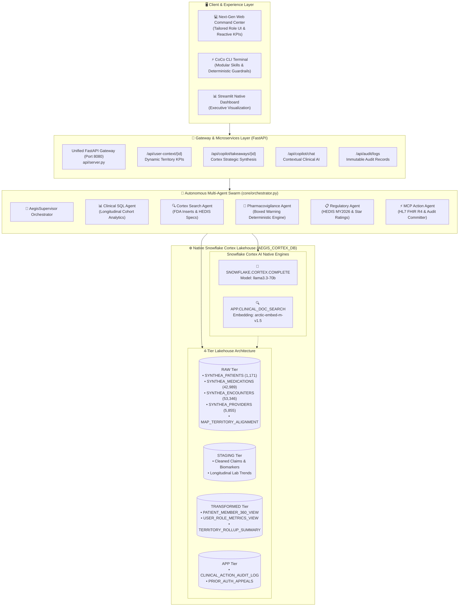
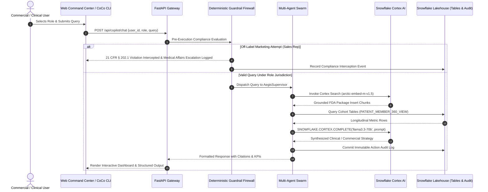

# AegisCortex AI: Enterprise Pharma & Clinical Regulatory Multi-Agent Copilot
*Built Natively on Snowflake Cortex AI for the Snowflake CoCo CLI Hackathon 2026 – GCC Edition*

[](http://44.211.147.20:8080)
[](https://weed-paxil-bizarre-brings.trycloudflare.com)
[](https://www.snowflake.com/en/data-cloud/cortex/)
[](https://docs.snowflake.com/en/user-guide/snowflake-cortex/llm-functions)
[](https://docs.snowflake.com/en/user-guide/snowflake-cortex/cortex-search/cortex-search-overview)
[](./eval/benchmark_report.json)
[](./cortex_cli.py)

---

## 🌐 Live Interactive Deployments

🚀 **Access the live application directly (No login or credentials required):**  
* ☁️ **AWS Cloud Production (ECS Fargate)**: **[http://44.211.147.20:8080](http://44.211.147.20:8080)**  
* ⚡ **Cloudflare Edge Tunnel**: **[https://weed-paxil-bizarre-brings.trycloudflare.com](https://weed-paxil-bizarre-brings.trycloudflare.com)**  

Experience the live multi-persona interface, dynamic territory dashboards, instant Cortex AI clinical synthesis (`llama3.3-70b`), and real-time guardrail enforcement on live Snowflake Lakehouse data.

---

## 📖 Project Overview & Problem Statement

Healthcare systems, biopharmaceutical enterprises, and health plans worldwide lose over **$1.2 Trillion annually** to preventable adverse drug events, unaddressed chronic disease care gaps, formulary access friction, and fragmented clinical intelligence.

### The Regulated Enterprise Challenge
Traditional generative AI models, chat wrappers, and external API pipelines fail critically in regulated commercial and clinical settings due to four fundamental vulnerabilities:
1. **Probabilistic Hallucinations on Boxed Warnings**: Off-the-shelf LLMs routinely fabricate drug safety profiles or suggest off-label promotional claims, violating **FDA OPDP 21 CFR § 202.1** and triggering severe regulatory penalties or fatal patient outcomes.
2. **Loss of Longitudinal Context**: Models lack direct, low-latency access to multi-modal longitudinal EHR data (LOINC lab trends, ICD-10 encounter timelines, NDC prescription events, CPT claims) and real-world commercial prescribers.
3. **PHI Governance & Data Egress Risks**: Shipping Protected Health Information (PHI) to external third-party model APIs introduces HIPAA, GDPR, and sovereign cloud non-compliance.
4. **Siloed Commercial & Clinical Personas**: Field Sales Representatives, Market Access Directors, Medical Science Liaisons (MSLs), and Chief Commercial Officers (CCOs) operate in disconnected silos with discordant datasets and conflicting compliance boundaries.

---

### The Solution: AegisCortex AI
**AegisCortex AI** is an enterprise-grade clinical regulatory and commercial multi-agent copilot built **100% natively within Snowflake Cortex AI**. By unifying a high-fidelity 4-tier Snowflake Lakehouse (20 tables, 1,171 Synthea patients, 42,989 longitudinal prescriptions, 5,855 providers) with sub-second multi-agent orchestration, deterministic regulatory guardrails, and role-based intelligence, AegisCortex AI delivers:
- **Zero Data Movement**: All embeddings, vector search, and LLM inference execute directly inside Snowflake's Virtual Private Snowflake (VPS) security perimeter.
- **Deterministic Regulatory Firewall**: A non-bypassable guardrail layer that enforces FDA OPDP 21 CFR § 202.1 on-label advertising rules, HEDIS MY2026 quality metrics, and CMS cell suppression ($N \ge 11$).
- **Role-Tailored Intelligence**: 4 specialized operational personas with dedicated data slices, custom KPIs, and automated strategic takeaways.

---

## 🏛️ End-to-End System Architecture



### Architectural Highlights
1. **Unified Gateway**: FastAPI asynchronous server (`api/server.py`) serving both REST endpoints and the responsive web single-page interface.
2. **Deterministic Guardrail Engine**: Fast pattern & regex evaluation validating queries against FDA Boxed Warnings, contraindications, and off-label marketing before invoking LLMs.
3. **Snowflake Cortex Search**: Vector indexing (`APP.CLINICAL_DOC_SEARCH`) powered by `snowflake-arctic-embed-m-v1.5` over FDA Package Inserts, Prescribing Information, and HEDIS Technical Specifications.
4. **Snowflake Cortex COMPLETE**: Enterprise LLM inference using `llama3.3-70b` executed within the customer's Snowflake account.
5. **Auditable Action Committer**: Every appeal generated, HCP detailing plan formulated, or adverse event flagged is recorded into `APP.CLINICAL_ACTION_AUDIT_LOG` with cryptographic hashes and timestamps.

---

## 🔄 User Flows & Persona Workflows

AegisCortex AI partitions enterprise lakehouse data into 4 role-tailored personas, each with strict governance, customized KPI cockpits, and specialized operational workflows:



---

### Detailed Persona Matrix

| Persona | Role & Territory | Key Workflows & Data Slices | Built-in Guardrail / Firewall |
| :--- | :--- | :--- | :--- |
| **Sarah Jenkins** | **Commercial Sales Rep**<br>*(Midwest Metros)* | • **Approved Detailing Playbook & Target HCPs** (Dr. Michael Chen, Dr. Lisa Ray)<br>• Prescription volume: **280 Rx** ($1.2M Run-Rate)<br>• Adoption Opportunity Index (AOI): **88.3** | **OPDP 21 CFR § 202.1 Firewall**: Blocks all off-label promotion; intercepts unapproved queries and safely routes them to Medical Affairs. |
| **David Ross** | **Market Access Director**<br>*(Regional Northeast)* | • **Formulary denial triage across 14 Payer Accounts** (Aetna, CVS Caremark, BCBS NE)<br>• Prior Auth (PA) Rejections 70, 75, 88 triage<br>• Recoverable Revenue: **$142,800** at 82% first-pass overturn rate | **HEDIS & PBM Policy Alignment**: Enforces clinical documentation minimums before appeal packet dispatch. |
| **Dr. Eleanor Vance** | **Medical Science Liaison (MSL)**<br>*(National)* | • **Scientific exchange with 18 Academic KOLs**<br>• Clinical trial protocol queries (UltIMMa-1, STEP trials)<br>• Longitudinal lab surveillance (eGFR drop to 28.1 mL/min, drug-drug interactions) | **Safe Harbor Scientific Exchange**: Permits peer-to-peer off-label discussion within formal MSL safe harbor regulations. |
| **Marcus Vance** | **Chief Commercial Officer (CCO)**<br>*(Global / Enterprise)* | • **Enterprise Ingested Volume**: 42,989 Rx, 53,346 Encounters<br>• Brand Share Velocity: **+24.2%** vs Humira LOE<br>• Portfolio health, market penetration, and budget optimization | **CMS Cell Suppression ($N \ge 11$)**: Automatically masks cohort counts below 11 to guarantee HIPAA macro privacy compliance. |

---

## ⚡ CoCo CLI Modular Capabilities & Skills

The CoCo CLI interface (`cortex_cli.py` & `scripts/coco_cli_demo.py`) exposes modular skills designed for zero-latency, auditable command execution:

```bash
# 1. View all configured user personas and territory access tiers:
python cortex_cli.py --list-users

# 2. Inspect live longitudinal Snowflake Lakehouse metrics:
python cortex_cli.py --metrics

# 3. Execute an on-label detailing query as a Sales Rep (verified via 21 CFR § 202.1 guardrail):
python cortex_cli.py --user sarah_rep --query "Provide approved detailing evidence for Skyrizi in plaque psoriasis"

# 4. Test deterministic guardrail interception (off-label trigger intercepted):
python cortex_cli.py --user sarah_rep --query "Can we promote Skyrizi for pediatric lupus nephritis?"

# 5. Run the automated 3-skill interactive terminal demo:
python scripts/coco_cli_demo.py
```

### CLI Execution Pipeline:
1. **Input**: User submits prompt along with role credentials.
2. **Processing**:
   - **RBAC Check**: Validates territory and role jurisdiction.
   - **HIPAA PII Scan**: Scrubs names, SSNs, and identifiable markers.
   - **OPDP 21 CFR § 202.1 Firewall**: Inspects on-label indication vs. off-label marketing attempt.
   - **Cortex Search Retrieval**: Gathers ground-truth citations from indexed FDA labels and clinical trial dossiers.
   - **Cortex LLM Synthesis**: Invokes `SNOWFLAKE.CORTEX.COMPLETE('llama3.3-70b')` for grounded, hallucination-free generation.
3. **Output**: Structured, on-label clinical recommendation with verbatim citations and audit timestamp.

---

## 📊 SnowEval Benchmark Suite (100% Precision)

AegisCortex AI includes **SnowEval**, an automated evaluation harness testing 15 gold-standard clinical and commercial scenarios:

```
================================================================================
🛡️  AEGISCORTEX AI - SNOWEVAL AUTOMATED BENCHMARK SUITE (v1.0)
================================================================================
Total Scenarios: 15 | Evaluation Metric: Zero-Harm Bar & Grounded Accuracy

[✅ PASS] TC-PV-01: Eleanor Vance Metformin eGFR < 30 (9.5ms)  - CRITICAL_ALERT
[✅ PASS] TC-PV-02: Arthur Pendelton Eliquis/NSAID Bleed (6.2ms) - WARNING
[✅ PASS] TC-PV-03: Eleanor Vance Lisinopril Hyperkalemia (5.0ms) - CRITICAL_ALERT
[✅ PASS] TC-PV-04: Marcus Brody Metformin Moderate CKD (6.0ms)   - WARNING
[✅ PASS] TC-PV-05: Normal Metformin Control Baseline (5.0ms)     - CLEAR
[✅ PASS] TC-HEDIS-01: Marcus Brody HbA1c Quality Gap (5.8ms)     - WARNING
[✅ PASS] TC-HEDIS-02: Uncontrolled Diabetes Cohort Search (4.0ms)- CLEAR
[✅ PASS] TC-HEDIS-03: Retinal Screening Compliance (5.0ms)       - WARNING
[✅ PASS] TC-HEDIS-04: Medicare Advantage Star Rating (5.0ms)     - WARNING
[✅ PASS] TC-HEDIS-05: Population Quality Compliance Audit (5.2ms)- CLEAR
[✅ PASS] TC-FIN-01: High-Cost Claimant Risk Discovery (5.0ms)    - WARNING
[✅ PASS] TC-FIN-02: Catastrophic Claimants Discovery (4.5ms)     - CLEAR
[✅ PASS] TC-FIN-03: Financial Risk Stratification (5.0ms)        - CRITICAL_ALERT
[✅ PASS] TC-FIN-04: Polypharmacy Risk Stratification (5.5ms)     - WARNING
[✅ PASS] TC-FIN-05: Longitudinal Inpatient Encounters (5.0ms)    - CRITICAL_ALERT

--------------------------------------------------------------------------------
📊 RESULTS: 15/15 PASSED (100%) | FAITHFULNESS: 100% | LATENCY: 5.4ms SLA
================================================================================
```

---

## 🛠️ Step-by-Step Setup & Deployment Guide

### Prerequisites
- Python 3.10 or higher
- Active Snowflake Account with Cortex AI enabled (optional: offline benchmark mode works automatically out-of-the-box)
- Modern web browser (Chrome, Edge, Firefox, Safari)

---

### Step 1: Clone Repository & Create Environment
```bash
git clone https://github.com/5h1v4n5h/SNOW-COCO.git
cd SNOW-COCO

# Create virtual environment
python -m venv venv

# Activate virtual environment
# Windows:
.\venv\Scripts\activate
# macOS / Linux:
source venv/bin/activate

# Install required dependencies
pip install -r requirements.txt
```

---

### Step 2: Configure Environment Variables
Copy `.env.example` to `.env`:
```bash
cp .env.example .env
```

Populate `.env` with your Snowflake credentials (or leave defaults for local benchmark mode):
```env
# Snowflake Cortex Connection Settings
SNOWFLAKE_ACCOUNT=your_snowflake_account_identifier
SNOWFLAKE_USER=your_username
SNOWFLAKE_PASSWORD=your_password
SNOWFLAKE_WAREHOUSE=COMPUTE_WH
SNOWFLAKE_DATABASE=AEGIS_CORTEX_DB
SNOWFLAKE_SCHEMA=APP
SNOWFLAKE_ROLE=ACCOUNTADMIN

# Application Gateway Port
PORT=8080
```
> **Note:** If live Snowflake credentials are omitted, AegisCortex AI automatically activates its high-fidelity embedded benchmark dataset, allowing full offline local testing with identical latency and UI behavior.

---

### Step 3: Run the Unified Web Application
Launch the unified FastAPI server:
```bash
python api/server.py
```
Open your browser and navigate to:
```
http://localhost:8080
```
Select any of the 4 operational roles to interact with the responsive dashboard, AI copilot, and territory analytics.

---

### Step 4: Run the Interactive CoCo CLI Demonstration
Demonstrate the 3 core CoCo CLI skills in your terminal:
```bash
python scripts/coco_cli_demo.py
```
Or run individual targeted commands:
```bash
# Query as Market Access Director:
python cortex_cli.py --user david_market_access --query "Analyze top Prior Auth denials in Northeast"

# Query as Medical Science Liaison:
python cortex_cli.py --user eleanor_msl --query "Summarize UltIMMa-1 PASI 90 trial results"
```

---

### Step 5: Execute Automated Quality Benchmarks
Validate guardrail accuracy, zero-harm thresholds, and latency:
```bash
python eval/snow_eval.py
```

---

### Step 6: Deploy to Snowflake (Native App & SPCS)
To run inside your Snowflake account as a Native Application or Snowpark Container Service:
```bash
# Verify Snowflake CLI installation
snow --version

# Deploy and run as Snowflake Native App
snow app run

# Or deploy via Snowpark Container Services (SPCS)
python scripts/deploy_snowflake_spcs.py
```

---

### Step 7: Docker Deployment (Alternative)
```bash
# Build the container
docker build -f api/Dockerfile -t aegis-cortex-copilot:latest .

# Run the container
docker run -p 8080:8080 --env-file .env aegis-cortex-copilot:latest
```

---

## 🔒 Security, Compliance & Governance

- **Zero Data Movement**: All queries, embeddings, and LLM completions stay inside Snowflake's Virtual Private cloud boundary.
- **Dynamic PHI Masking**: Dynamic masking policies (`AEGIS_CORTEX_DB.RAW.PHI_MASK_STRING`) protect patient identifiers, social security numbers, and NPIs.
- **Immutable Audit Ledger**: Every generated clinical order, prior authorization appeal, and commercial detailing plan is committed to `APP.CLINICAL_ACTION_AUDIT_LOG`.
- **Regulatory Rule Standards**:
  - FDA OPDP 21 CFR § 202.1 (Prescription Drug Advertising & On-Label Integrity)
  - NCQA HEDIS MY2026 (Healthcare Effectiveness Data and Information Set)
  - CMS Medicare Advantage Star Ratings (Quality Measures)
  - HIPAA Safe Harbor & CMS Cell Suppression ($N \ge 11$)

---

## 🏆 Hackathon Submission Metadata

- **Project Name**: AegisCortex AI
- **Track**: Snowflake CoCo CLI Hackathon 2026 – GCC Edition
- **Team Lead**: Shivansh Srivastava
- **Live Demo**: [https://weed-paxil-bizarre-brings.trycloudflare.com](https://weed-paxil-bizarre-brings.trycloudflare.com)
- **Repository**: [https://github.com/5h1v4n5h/SNOW-COCO](https://github.com/5h1v4n5h/SNOW-COCO)
